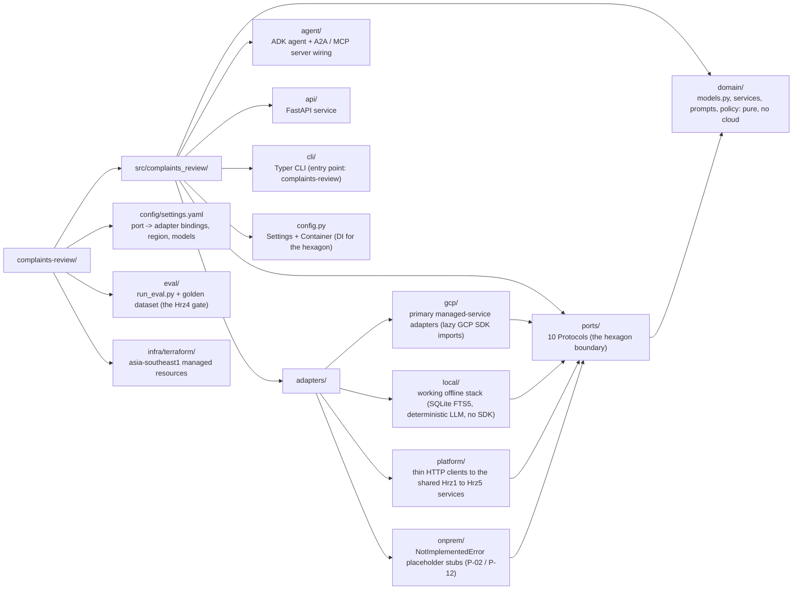

# Architecture · Doc6 Complaints & Conduct File Review

Doc6 is a hexagonal (ports-and-adapters) service. The **domain core** is pure Python with no
cloud dependency; every external capability is reached through a **port** (a
`typing.Protocol`); each port has four interchangeable **adapter** families (`gcp`,
`local`, `platform`, `onprem`) selected by a one-line `profile` switch. This is what makes
the managed Google Cloud stack swappable for a working offline laptop stack, or an
on-premise one, without touching domain logic (P-02, no vendor lock-in).

## Layered view

## Ports (the hexagon boundary)

| Port | Responsibility | gcp adapter | local adapter | platform adapter | onprem adapter |
|------|----------------|-------------|---------------|------------------|----------------|
| `DocumentExtractionPort` | Parse a complaint document | Document AI | local parser (pypdf / text) | n/a | stub |
| `KnowledgeBaseClientPort` | Governed RAG over policy / regulation (Hrz2) | Agent Search | SQLite FTS5 (BM25) | Hrz2 `/v1/search` | stub |
| `LLMPort` | Summarise, categorise, draft (Gemini) | Gemini | deterministic schema-driven | n/a | stub |
| `GuardrailPort` | Screen input + output (Hrz1) | Model Armor | heuristic injection screen | Hrz1 `/v1/guardrail/screen` | stub |
| `PIIRedactionPort` | De-identify PII (Hrz1) | DLP | regex (NRIC, email, phone) | Hrz1 `/v1/redact` | stub |
| `AuditSinkPort` | WORM audit (Hrz5) | Cloud Logging | append-only SQLite | Hrz5 `/v1/audit` | stub |
| `ObservabilityTracerPort` | Trace spans (Hrz5) | Cloud Trace | no-op spans | n/a | no-op |
| `EvaluationGatePort` | Promotion eval (Hrz4) | Gen AI evals | offline `run_eval.py` | Hrz4 `/v1/evaluations` | stub |
| `AgentRegistryPort` | A2A registry (Hrz3) | in-process | in-process (Firestore emulator opt-in) | Hrz3 `/v1/agents` | stub |
| `ToolCatalogPort` | Governed MCP tools (Hrz3) | in-process | in-process | n/a | stub |

The `local` adapters are SDK-free, deterministic and seedable: they run the whole pipeline
offline (no Google Cloud, no API key, no emulators by default) and drive the test suite, so
the offline tests exercise the same code the CLI runs. The `onprem` adapters construct with
a single `Settings` argument, structurally satisfy the
same Protocol, and raise `NotImplementedError` from every method (except the tracer, which
is a safe no-op). The contract test (`tests/contract/test_port_parity.py`) proves this
parity for every port.

## The domain core

The orchestration lives in three services plus a policy, all pure Python:

- **`ComplaintReviewService`** : the end-to-end pipeline. It redacts, guardrail-screens
  (INPUT), extracts and redacts attached documents, retrieves policy from Hrz2, summarises,
  categorises, drafts, guardrail-screens (OUTPUT), assembles the `ComplaintReview`, and
  audits. A guardrail block or an empty corpus raises rather than emit a partial or
  ungrounded conduct decision.
- **`CategorizationService`** : the category, root cause and conduct flags. Conduct flags
  merge a deterministic policy (a vulnerable-customer keyword in the narrative forces a
  `VULNERABLE_CUSTOMER` flag; a breach of the complaint-handling window forces a
  `DEADLINE_RISK` flag) with the model's proposed flags. Deterministic flags are
  authoritative and cannot be removed by the model.
- **`ResponseDraftingService`** : the grounded draft response, always stamped as a draft and
  always `requires_human_review=True`.
- **`ComplaintReviewPolicy`** : the maker-checker gate (P-06). A review always requires human
  review; the draft is never sendable by the system; high-stakes flags or severities
  escalate to a senior checker.

The services share a `_grounded.py` helper (passage rendering, structured-output parsing,
citation mapping, enum coercion) so each keeps the exact constructor and method signature
the SPEC mandates while sharing one well-tested core.

## Profiles and wiring

`config.py` reads `config/settings.yaml` (with `${ENV_VAR}` interpolation), and the
`Container` binds each port to the dotted-path adapter for the active `profile`, falling
back to the `gcp` entry. `COMPLAINTS_PROFILE` selects `gcp` (managed), `local` (the working
offline stack), `platform` (the shared Hrz1 to Hrz5 services over HTTP) or `onprem` (the
migration stubs). The default for dev, tests and CI is `local`, which is why the whole suite
runs end to end with no Google Cloud SDK installed; the production default in
`settings.yaml` is `gcp`.

## Residency and safety

Every managed resource is pinned to `asia-southeast1`. Customer PII is redacted at the
boundary before it reaches the model, the knowledge base, a trace span or the audit sink
(P-04). The guardrail screens both directions (R1). The audit trail is a locked WORM bucket
with ~7-year retention (R2). Trace spans never carry message content. The draft response is
never sent by the system: a human reviews and sends it (P-06).

## Kernel and vertical boundary

`domain/kernel.py` is the stable evidence, model-boundary, safety, redaction, audit, and
agent-discovery seam. Complaint files, categorisation, conduct flags, response drafting,
and complaint policy form the replaceable vertical. A fork keeps the kernel and ports
while replacing those vertical artifacts.
