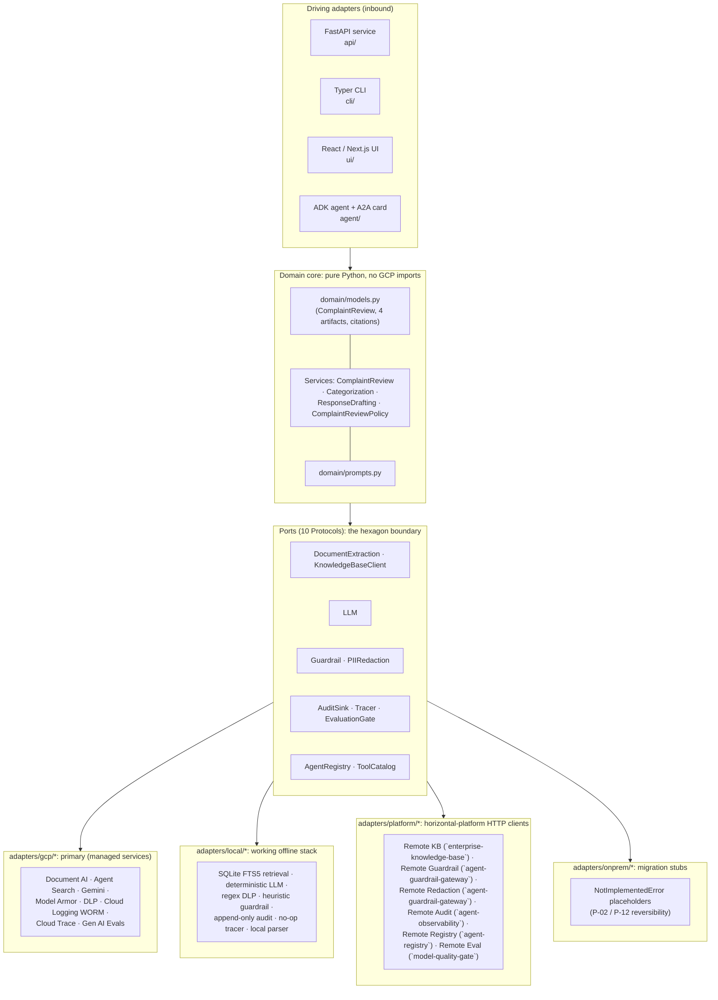
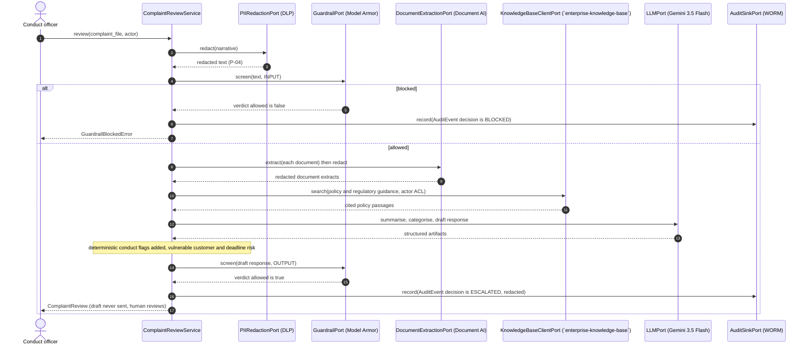

# `complaints-review` · Complaints & Conduct File Review

**Industries:** Banking, Insurance, Telecom, Utilities, Healthcare, Public sector

A conduct-ops assistant for Complaints and Conduct teams at APAC banks. From a customer
complaint / conduct file it produces four cited, audited, maker-checker artifacts:

1. **ComplaintSummary** : a structured summary of the file (issue, products, channel, a
   timeline of events, parties).
2. **Categorization** : a category (mis-selling, fees, service, access, conduct, fraud,
   other) with a root cause, severity and regulatory relevance, cited to policy.
3. **ConductFlag[]** : conduct red flags (vulnerable customer, systemic issue, regulatory
   breach, complaint-handling-deadline risk), each with severity, detail and citations.
4. **DraftResponse** : a regulator-ready / customer-ready draft, grounded in policy and
   regulation. It is **always a draft and is never sent by the system**: a human reviews
   and sends it (P-06 / R1).

Built ports-and-adapters (hexagonal) on the **Gemini Enterprise Agent Platform** (the
service formerly called Vertex AI), pinned to **asia-southeast1** (Singapore) for data
residency. Complaint files carry customer PII, so the **full R1 safety pipeline** runs:
redact, then guardrail screen on the way in and out, with everything audited to a
write-once (WORM) store. Policy and regulatory guidance is retrieved from the shared
**`enterprise-knowledge-base`** (governed RAG, rule R3), not a bespoke backend.

> This is an engineering-portfolio reference repo. All complaint data here is synthetic
> and fictional.

## Architecture at a glance



## The review pipeline (full R1 safety, audited)



## Quickstart (no Google Cloud SDK required)

```bash
python3.12 -m venv .venv && . .venv/bin/activate
pip install -e ".[dev]"           # core + dev only, no google-cloud-*
export COMPLAINTS_PROFILE=local   # the WORKING offline profile. Set it deliberately: an
                                  # unset variable binds the same offline adapters but is not
                                  # read as CHOOSING local, so the seeded no-auth personas are
                                  # refused and the localhost CORS fallback does not apply.

make test                         # ruff + pytest on the local profile
python eval/run_eval.py           # the `model-quality-gate` / P-08 eval gate
```

There are four deployment profiles, selected by `COMPLAINTS_PROFILE`:

| Profile | Backends | When |
|---------|----------|------|
| `local` | SQLite FTS5 retrieval, deterministic LLM, regex DLP, heuristic guardrail, append-only audit, no-op tracer, local parser. No Google Cloud, no API key, no emulators. | Default for dev and test: runs the whole pipeline offline on a laptop. |
| `gcp` | Document AI, Agent Search, Gemini, Model Armor, DLP, Cloud Logging WORM, Cloud Trace, Gen AI Evals. Needs the `[gcp]` extra (`pip install -e ".[gcp,dev]"`). | Production managed stack. |
| `platform` | Guardrail, redaction, knowledge-base, audit, registry and eval ports over HTTP to the shared `agent-guardrail-gateway` to `agent-observability` services (see `.env.example`). | Inside the full platform. |
| `onprem` | Fail-fast `NotImplementedError` placeholders. | Google Distributed Cloud migration target (P-02 / P-12). |

## Run locally (offline, end to end)

The `local` profile self-seeds a tiny synthetic policy / regulatory corpus into a SQLite
FTS5 index on first use, so a complaint review runs offline with no setup and returns a
real, page-cited artifact:

```bash
export COMPLAINTS_PROFILE=local
complaints-review CMP-LOCAL-001 \
  --narrative "The branch sold me a structured investment product I did not understand and I am a vulnerable customer." \
  --product "structured investment product" --channel branch --received 2026-06-01
# or simply:
make run-local
```

The command prints a summary, a categorisation (`mis_selling`, severity `high`),
deterministic conduct flags (vulnerable customer, deadline risk), and a draft response,
each with `[source_id p.N]` citations into the seeded corpus. Customer PII (NRIC, email,
phone) is redacted before retrieval, the model and the audit log.

Optional higher-fidelity local runs: set `FIRESTORE_EMULATOR_HOST` (and install the
`[gcp]` extra) to route the in-process registry to the official Firestore emulator. The
google client is imported lazily, only on that branch: the default offline path imports
no google-cloud package and needs no emulator.

## CLI

```bash
complaints-review CMP-1 --narrative "The branch sold me an unsuitable product" \
  --product "investment product" --channel branch
complaints-review summary CMP-1 --narrative "..."
complaints-review draft-response CMP-1 --narrative "..."
complaints-review serve --port 8095
```

Under the `onprem` profile every command exits cleanly with code 2 and a message naming the
migration target, because the placeholder adapters raise `NotImplementedError`.

## HTTP API

Requests carry no `actor`: identity is resolved server side from the verified `Principal` (an IAP
assertion in gcp/platform, or a seeded dev persona selected via the `X-Dev-Persona` header in
local), never from the request body. See
[docs/embedding-and-identity.md](docs/embedding-and-identity.md).

| Method · path | Purpose |
|---------------|---------|
| `POST /v1/review` | Full cited `ComplaintReview` (summary, categorisation, flags, draft). |
| `POST /v1/summary` | Only the `ComplaintSummary`. |
| `POST /v1/draft-response` | Only the `DraftResponse` (a draft, never sent). |
| `GET /v1/personas` | Seeded dev personas for the local persona picker (empty outside `local`). |
| `GET /healthz` | Liveness + active profile + region. |
| `GET /.well-known/agent-card.json` | A2A AgentCard for discovery (`agent-registry`). |

## Repo map

| Path | What |
|------|------|
| `src/complaints_review/domain/` | Pure domain: models, services, prompts, policy. No cloud imports. |
| `src/complaints_review/ports/` | 11 `Protocol` ports (the hexagon boundary, incl. `IdentityPort`). |
| `src/complaints_review/adapters/{gcp,platform,onprem}/` | The three adapter families. |
| `src/complaints_review/{api,cli,agent}/` | Driving adapters (FastAPI, Typer, ADK). |
| `config/settings.yaml` | Port to adapter bindings, region, models. |
| `infra/terraform/` | asia-southeast1 infra (Document AI, DLP, Model Armor, KMS, WORM, IAM, VPC-SC). |
| `eval/` | The offline `model-quality-gate` / P-08 eval gate + golden set + rubrics. |
| `ui/` | React / Next.js demo console (source only). |

See `SPEC.md`, `ARCHITECTURE.md` and `COMPLIANCE.md` for the detail.

## Cost and latency

Size this system's cost and latency with the shared interactive calculator: [**live**](https://portable-genai.github.io/cost-latency-calculator/calc/calculator.html?system=complaints-review) or the [in-repo page](cost-latency-calculator.html). The engine and the pricing book are maintained once in [cost-latency-calculator](https://github.com/portable-genai/cost-latency-calculator).

## Documentation authority

Precedence is `SPEC.md` > `ARCHITECTURE.md` > `COMPLIANCE.md` > `README.md`. The first
document owns behavior; later documents explain design, evidence, and use without
overriding it.
